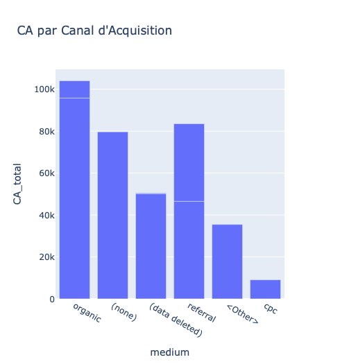
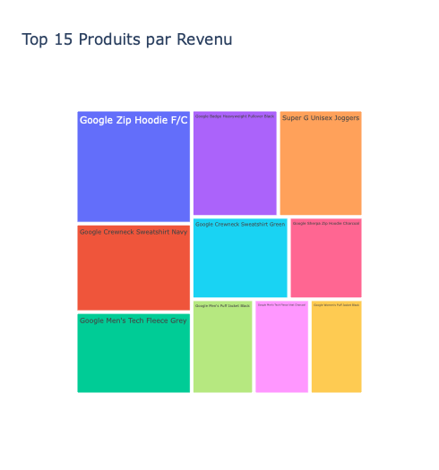
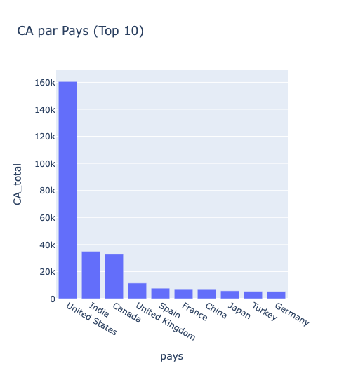
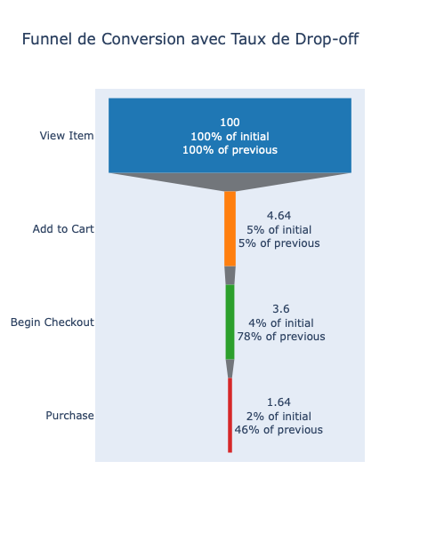
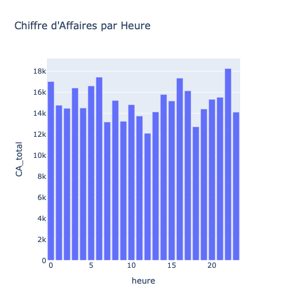
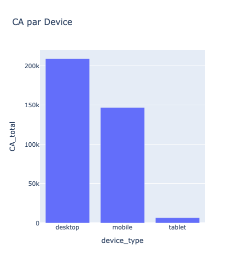

# Analyse approfondie des ventes et optimisation de la rentabilité  
**Google Merchandise Store (GA4 Sample)**

**Outils :** BigQuery (SQL) + Python (Pandas + Plotly)  
**Dataset :** bigquery-public-data.ga4_obfuscated_sample_ecommerce  
**Date :** Mars 2026  
**Auteur :** Alice Plaquet

---

### 📋 Contexte business

Le Google Merchandise Store est la boutique officielle en ligne de produits Google.  
Cette analyse combine **10 requêtes SQL avancées** et **6 visualisations interactives Plotly** pour identifier les fuites du funnel, calculer des KPIs précis et proposer des recommandations actionnables.

---

### 🎯 Objectifs

- Analyser le funnel de conversion avec taux de drop-off  
- Calculer les KPIs business chiffrés  
- Identifier les top produits, devices, pays et canaux  
- Détecter les tendances temporelles (jour + heure)  
- Créer des visualisations claires et impactantes

---

### 📈 Visualisations

**1. Funnel de Conversion avec taux de drop-off**  

**2. Top 15 Produits par Revenu**  

**3. Chiffre d'Affaires par Heure de la Journée**  

**4. CA par Type de Device**  

**5. CA par Pays (Top 10)**  

**6. CA par Canal d'Acquisition**  

---

### 📊 KPIs chiffrés absolus (nov. 2020 – jan. 2021)

- **CA total** : **362 165 $**  
- **Nombre d’achats** : **5 692**  
- **Panier moyen** : **63,63 $**  
- **Utilisateurs uniques** : **270 154**  
- **Sessions** : **360 129**  
- **Événements** : **4,29 millions**  
- **Conversion globale** : **1,64 %**

---

### 👥 Segmentation clients simple

| Segment                        | % du CA | CA moyen par client | Caractéristiques principales          |
|--------------------------------|---------|---------------------|---------------------------------------|
| **Desktop Premium**            | 56,7 %  | 64,73 $             | Forte contribution, panier élevé      |
| **Mobile**                     | 41,4 %  | 62,32 $             | Volume important                      |
| **Tablet**                     | 2,0 %   | 59,30 $             | Marginal                              |
| **Top Pays (US + Inde + Canada)** | ~61 % | 66–70 $             | Meilleurs paniers moyens              |

---

### 💡 Insights clés

- Conversion globale très faible (~1,64 %) → énorme opportunité d’amélioration du funnel  
- Desktop domine le CA, mais le mobile est presque aussi performant en panier moyen  
- États-Unis = **43,59 %** du CA total  
- Mercredi est le jour le plus rentable ; les heures de nuit et tôt le matin offrent les meilleurs paniers moyens

---

### 🚀 Recommandations actionnables

| Recommandation                                      | Impact estimé          |
|-----------------------------------------------------|------------------------|
| Simplifier le parcours Add to Cart → Checkout       | +15–25 % de CA         |
| Promotions flash la nuit et tôt le matin            | +10–15 % de CA         |
| Renforcer le SEO Google Organic                     | Renforcer canal n°1    |
| Optimiser l’expérience mobile                       | +5–10 % de CA          |
| Créer des bundles sur les hoodies/sweatshirts       | Augmentation AOV       |
| Campagnes locales sur Inde, Canada, Europe          | Croissance marchés     |

---

### 📁 Fichiers du projet

- `queries/` → Les 10 requêtes SQL  
- `visualizations/` → Les 6 graphiques PNG  
- `README.md` → Ce fichier

**Auteur :** Alice Plaquet  
**Date :** Mars 2026
